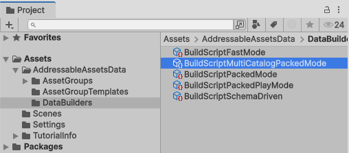
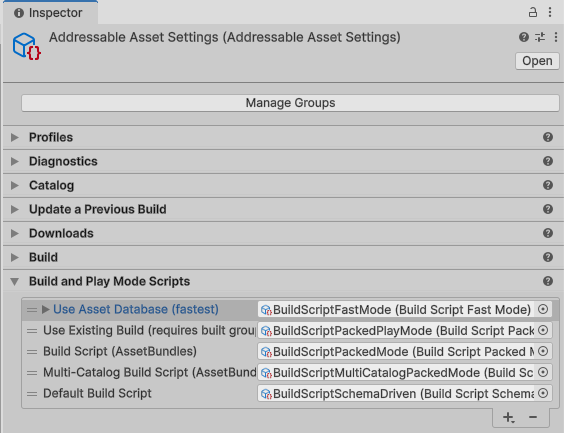
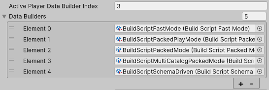
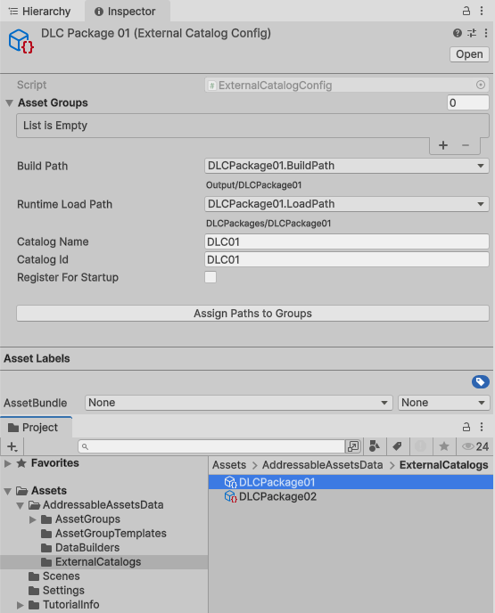
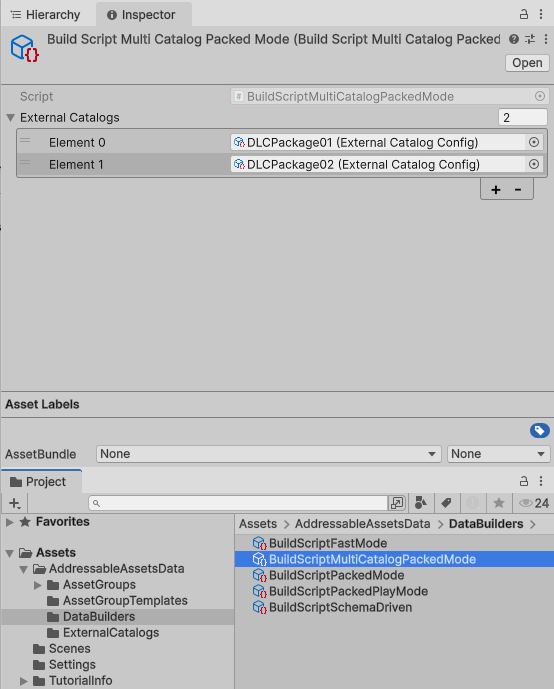
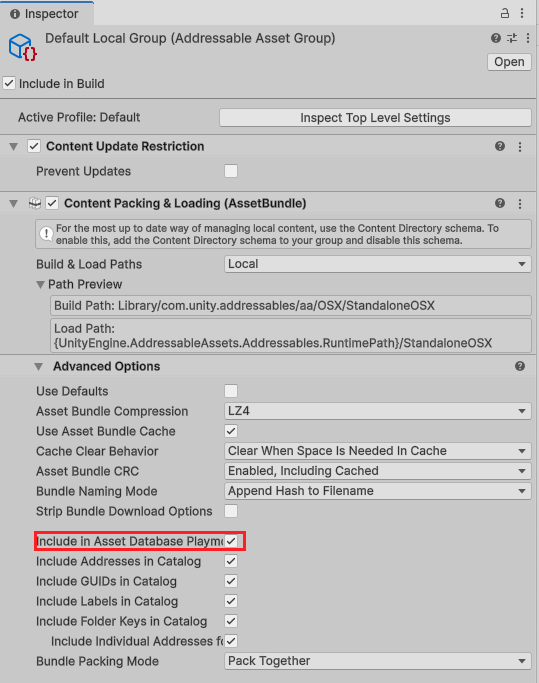

# Addressables - Multi-Catalog

The Addressables package by Unity provides a novel way of managing and packing assets for your build. It replaces the
Asset Bundle system, and in certain ways, also seeks to dispose of the Resources folder.

This variant, forked from the original Addressables-project, adds support for building your assets across several
catalogs, ideal for managing additional content or DLC for your game.

This package currently tracks version `4.0.1` of the vanilla Addressables packages. Checkout a `multi-catalog` tag if
you require a specific version.

## Notes before you begin

1. When using the multi-catalog build option to build your Addressables content, the content update pipeline and remote
   catalogs are not explicitly supported and is largely untested. The default content build pipeline is unaffected
   though, and should still work for these features.
2. This repository does not track every available version of the _vanilla_ Addressables package. It's only kept
   up-to-date sporadically.
3. For additional features found in this fork of Addressables, check the [Additional features](#additional-features)
   section.

## Upgrades notes

Some updates of this package may contain breaking changes. Check the upgrade notes below when you're crossing a version
number that requires your attention to get your setup back in working order.

* [From 1.21.2 to 1.21.9 and later](#from-1212-to-1219-and-later)
* [From 2.11.1 to 3.0.0 and later](#from-2111-to-300-and-later)
* [From 3.1.0 to 4.0.0 and later](#from-310-to-400-and-later)

## Why does this exist?

The multi-catalog version of Addressables came into existence to address the need for a more flexible and efficient
solution for managing DLC packages and other content bundles within a game. It provides a way to organize and manage
assets and features in a DLC package that may rely on assets already present in the base game.

The vanilla version of Addressables does not explicitly support this feature, and workarounds are usually very
convoluted in one of several ways e.g., error prone entitlement checks, long build times, unnecessary build cache
invalidation, and duplicate assets in memory. This creates a lot of friction for developers who want want to use
Addressables for traditional DLC usecases, as well as for users who will experience larger downloads and increased
memory usage.

This fork of Addressables aims to address these issues by allowing you to author assets as part of a specific DLC within
your project and assigning these asset groups to the DLC catalog object.

## Installation

This package is best installed using Unity's Package Manager. Fill in the URL found below in the package manager's input
field for git-tracked packages:

> <https://github.com/juniordiscart/com.unity.addressables.git>

### Updating a vanilla installation

When you've already set up Addressables in your project and adjusted the settings to fit your project's needs, it might
be cumbersome to set everything back. In that case, it might be better to update your existing settings with the new
objects rather than starting with a clean slate:

1. Remove the currently tracked Addressables package from the Unity Package manager and track this version instead as
   defined by the [Installation section](#installation). However, **don't delete** the `Assets/AddressableAssetsData`
   folder from your project!

2. In your project's `Assets/AddressableAssetsData/DataBuilders` folder, create a new 'multi-catalog' data builder:

   > Create → Addressables → Content Builders → Multi-Catalog Build Script

   

3. Select your existing Addressable asset settings object, navigate to the `Build and Play Mode Scripts` property and
   add your newly created multi-catalog data builder to the list.

   

4. Optionally, if you have the Addressables build set to be triggered by the player build, or have a custom
   build-pipeline, you will have to set the `ActivePlayerDataBuilderIndex` property. This value must either be set
   through the debug-inspector view (it's not exposed by the custom inspector), or set it through script.

   

### Setting up multiple catalogs

With the multi-catalog system installed, additional catalogs can now be created and included in build:

1. Create a new `ExternalCatalogConfig` object, one for each DLC package:

   > Create → Addressables → External Catalog

2. In this object, fill in the following properties:
    * Asset groups: the Addressable asset groups that belong to this DLC package.
    * Catalog name: the name of the catalog file produced during build.
    * Catalog ID: a unique identifier for this catalog. This is used mostly during the build process, but it's also used
      at runtime if you register your catalog to be loaded at startup.
    * Register for startup: when checked, the catalog will be loaded automatically when the game starts. Note that
      initializaion of the Addressables system can fail if the catalog is not available. Default value is `false`.
    * Build path: where this catalog and it's assets will be exported to after the build is done. This supports the same
      variable syntax as the build path in the Addressable Asset Settings.
    * Runtime load path: when the game is running, where should these assets be loaded from. This should depend on how
      you will deploy your DLC assets on the systems of your players. It also supports the same variable syntax.

   

   Important notes regarding Addressable Asset Groups assigned to external catalogs:
    * An Addressable Asset Group can only belong to one catalog. If you need to share assets between multiple external
      catalogs, the group is best left in the main catalog.
    * Make sure the paths for your groups are also set appropriately. The inspector window for External Catalog Configs
      allows you to assign the same build and load paths for all assigned groups.

3. Now, select the `BuildScriptMultiCatalogPackedMode` data builder object and assign your external catalog object (s).

   

## Building

With everything set up and configured, it's time to build the project's contents! From the build tab, there's the
`Multi-Catalog Build Script (AssetBundles)` option. Select this one to start a content build with the multi-catalog
setup.

Or, if you have set Addressables to be built when the player is built, then make sure the active builder index is set to
the appropriate builder. This value should've been set correctly automatically when setting Addressables up through this
package for the first time. If you were upgrading from a vanilla installation, then please check out the section
about [updating a vanilla installation](#updating-a-vanilla-installation).

## Loading the external catalogs

When you need to load in the assets put aside in these external packages, you can do so using:

> `Addressables.LoadContentCatalogAsync("DLCPackages/DLCPackage01/DLC01.bin");`

## Additional features

Below you'll find additional features in this fork of Addressables that were considered missing in the vanilla flavour
of Addressables.

### Addressables scene merging

When merging scenes using `SceneManager.MergeScenes`, the source scene will be unloaded by Unity. If this source scene
is a scene loaded by Addressables, then its loading handle will be disposed off and releasing all assets associated with
the scene. This will cause all merged assets from the source scene to be unloaded as well, resulting in uninitialized
resources to no longer properly load when becoming active for the first time.

This is resolved by adding a `MergeScenes` method to `Addressables`, similar to `SceneManager.MergeScenes`, but will
keep the Addressable scene's loading handle alive until the destination scene is unloaded. This can be daisy-chained
multiple times, passing the loading handle until its current bearer is finally unloaded.

### Include in AssetDatabase playmode

When a project aims to support multiple target platforms or variants of the same project, you may want some groups to be
available or not during testing for that specific platform. However, using the fast-mode script in editor will always
yield all results of assets that are registered as an Addressable asset.

This fork provides an option to include or exclude a specific group from the playmode that uses the asset database as a
source of assets.

### Addressables group sorting fix

The object that holds the sort settings for Addressable Asset Groups is always placed at `Assets/AddressableAssetsData`,
regardless of where the AddressableAssetSettings object lives. This group sorting object in this fork of Addressables is
always placed next to the AddressableAssetSettings object. This makes it easier to work with multiple
AddressableAssetSettings in a single project.

## Migration notes

### From 1.21.2 to 1.21.9 and later

If you're updating from a multi-catalog version of Addressables with version number `1.21.2` or earlier to version
`1.21.9` or later, then please read the notes below carefully to restore your project's build.

* `ExternalCatalogSetup` has had its `buildPath` and `runtimeLoadPath` values be changed in type. This will result in
  empty values on your external catalog objects upon upgrading, and content builds failing. The types have been updated
  to work with Addressables' `ProfileValueReference` framework. This allows to work with the built-in string evaluation
  functions and profile-defined variables in a more transparent way as it also properly previews the result in the
  inspector window.

### From 2.11.1 to 3.0.0 and later

The update from `2.11.1` to `3.0.0` was a major rewrite of the build system of Addressables. To keep this package
somewhat maintainable, some implicit build behaviour that originally shipped with the Multi-Catalog edition of
Addressables has been removed and now requires explicit action by the person setting up the Addressables Asset Groups.

* Originally, Addressable Asset Groups that were assigned to an external catalog that had their build and load path
  still set to the local build and load path, would silently swap out their paths with the that of the external catalog.
  From `3.0.0` on, this behaviour no longer happens. Addressable Asset Groups now require their build and load paths be
  explicitly be set to their desired destinations. To alleviate this inconvenience, the `ExternalContentConfig`
  inspector window has been given a button to update the paths of the assigned Addressable Asset Groups to that of the
  external catalog they belong to.
* Renamed the `ExternalCatalogSetup` class to `ExternalCatalogConfig`.
* Renamed the `BuildScriptPackedMultiCatalogMode` class to `BuildScriptMultiCatalogPackedMode`.

### From 3.1.0 to 4.0.0 and later

Addressables 4.0 again overhauled the build system significantly, which prompts to also partially rewire the
multi-catalog scripts. The following will require your attention:

* Each `ExternalCatalogConfig` object now expects a unique `Catalog Id` value to be set. This is internally used during
  the build process to identify which catalog a data entry belongs to. This can be the name of your catalog, if it is
  unique. Note that the internal `Catalog Id` of the main catalog is `AddressablesMainContentCatalog`.